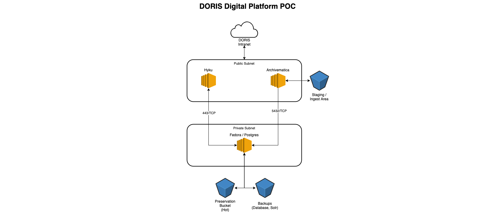
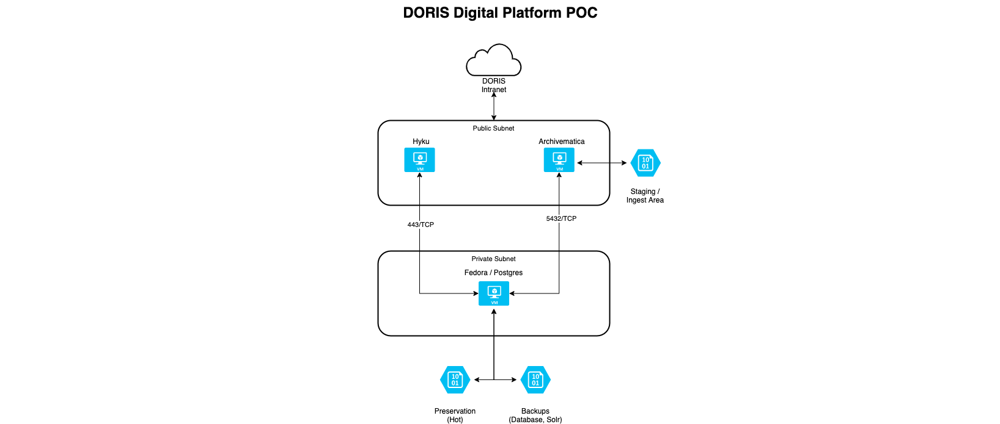

Proof-of-Concept
================

The THELMA Proof-of-Concept (POC) deployment will contain the following components:

- Archivematica - Will be used to ingest and preserve a test collection. This is a Python (Django) web application. Archivematica uses a number of microservices and additional tools:
  - ElasticSearch - You Know, For Search. Will be used to index collection items and store data about our preservation activities
  - Gearman - A process scheduler used to process collections
- MySQL - Archivematica uses MySQL as a backend by default. DORIS is looking into migrating to Postgres to standardize our stack, but it is not in scope for the POC.
- Hyku - An opinionated version of Hyrax, is our public facing collection interface. Provides a front-end to Fedora, the archival management platform. This is a Ruby on Rails application.
- Fedora - The Flexible Extensible Digital Object Repository Architecture is the digital asset management system that will manage our files stored in object storage. This is a Java application running with Tomcat.

Infrastructure
--------------

The POC should be built using a combination of Ansible, Packer, and Terraform. DORIS uses Ansible to install applications and configure our eervers, Packer to build our server images, and Terraform to deploy our infrastructure. 

The code for the POC is available at: <https://github.com/nycrecords/doris-digital-platform-poc/>.

The README contains detailed instructions for creating images and deploying the infrastructure.

Test Scenario
-------------

The test collection used for the POC is 778 GB in size (spread across 2,667 files). The files are all TIFF photographs.

A successful test of the POC will be to copy our test collection into object storage and ingest it into Archivematica. Archivematica will output the preserved files to object storage, where they will be manually ingested into Hyku (and Fedora) for display through the GUI.

